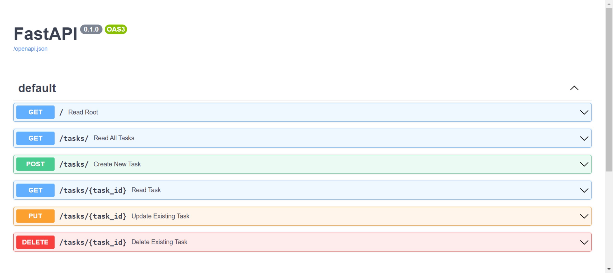
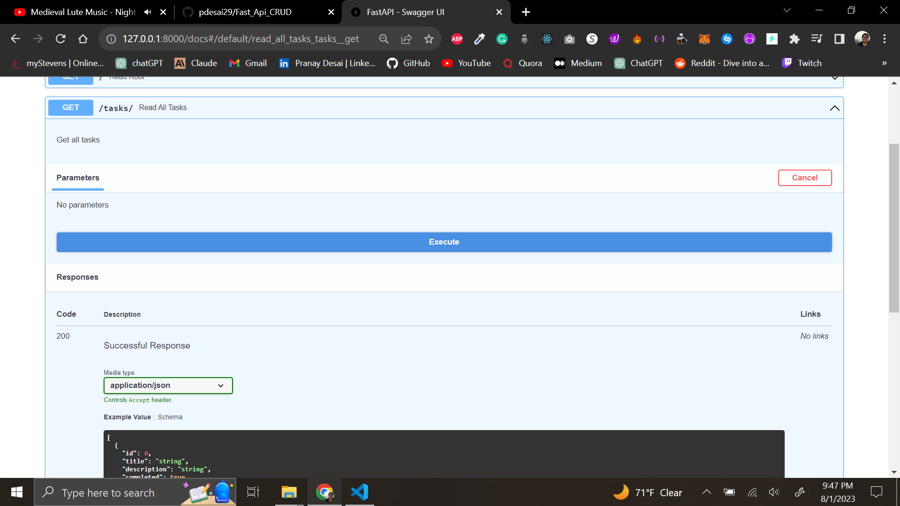
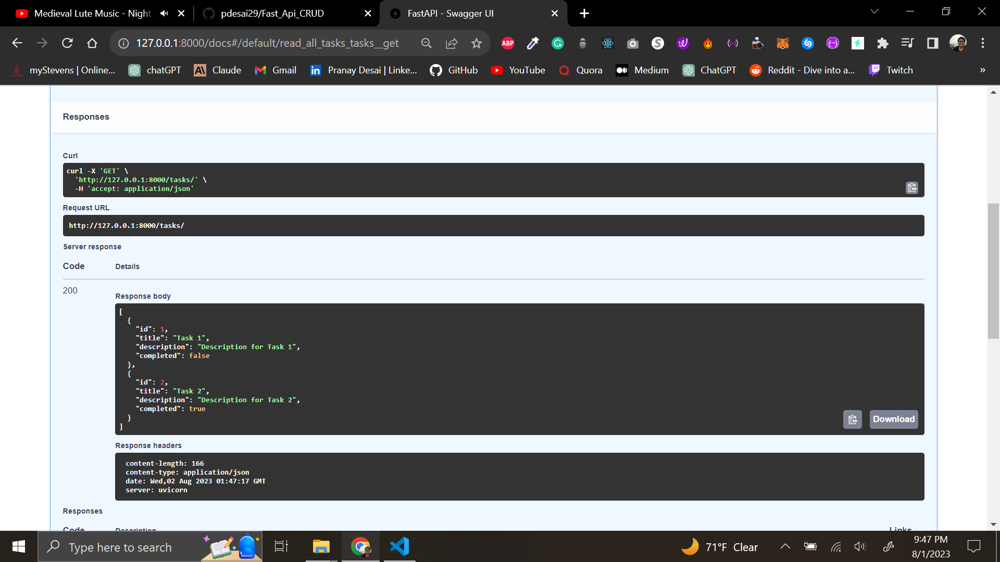
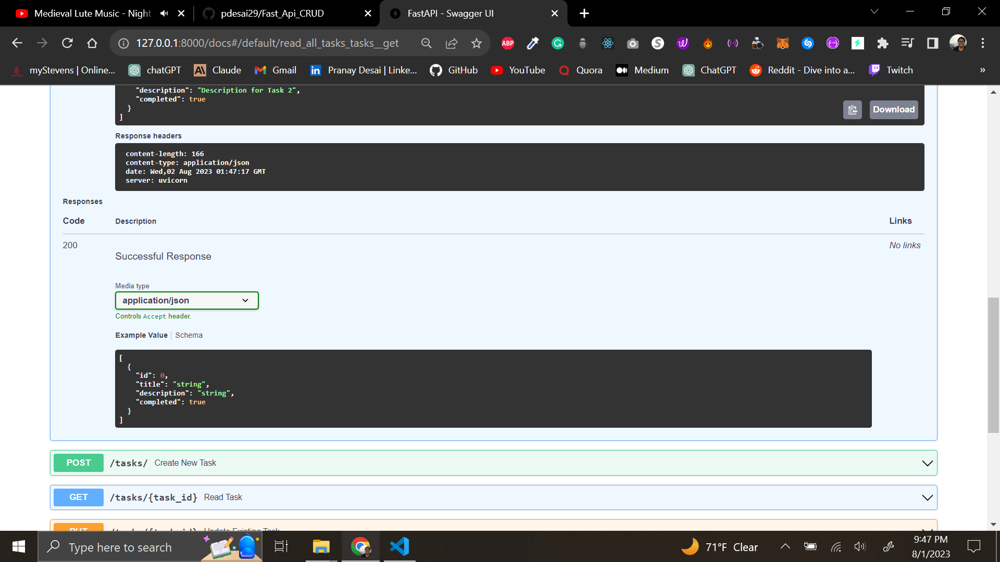

# FastAPI Task API with CRUD Operations
## GOAL of the Project is to explore FastAPI

This is a simple FastAPI project that demonstrates a Task API with CRUD (Create, Read, Update, Delete) operations. The API allows you to manage tasks with title, description, and completion status. The project is organized to showcase FastAPI's features like Pydantic models, dependency injection, and automatic Swagger documentation.

## Features

- Create a new task with a title, description, and completion status.
- Read all tasks or a specific task by its ID.
- Update an existing task by its ID.
- Delete a task by its ID.


## Dependencies
- FastAPI: A modern, fast (high-performance), web framework for building APIs with Python.
- Uvicorn: An ASGI server for running FastAPI applications.
- Pydantic: Data validation and parsing library used for defining the data models.
## Installation

1. Clone the repository:

```bash
git clone https://github.com/pdesai29/Fast_Api_CRUD
cd Fast_Api_CRUD

```

2. Install fastapi and uvicorn 

```bash 
pip install fastapi
pip install "uvicorn[standard]"
```

3. Run 
```bash
uvicorn main:app --reload
```

4. Visit: http://127.0.0.1:8000

## FastApi Features

1. Based on open standards
    - OpenAPI for API creation, including declarations of path operations, parameters, body requests, security, etc.
    - Automatic data model documentation with JSON Schema (as OpenAPI itself is based on JSON Schema).
  
2. Automatic docs (Amazing⭐)
    - Interactive API documentation and exploration web user interfaces. As the framework is based on OpenAPI, there are multiple options, 2 included by default.
    - Swagger UI, with interactive exploration, call and test your API directly from the browser.
    - Alternative API documentation with ReDoc.

### Test and learn about API with Swagger UI or ReDoc

## Swagger UI : http://127.0.0.1:8000/docs





## ReDoc : http://127.0.0.1:8000/redoc 


